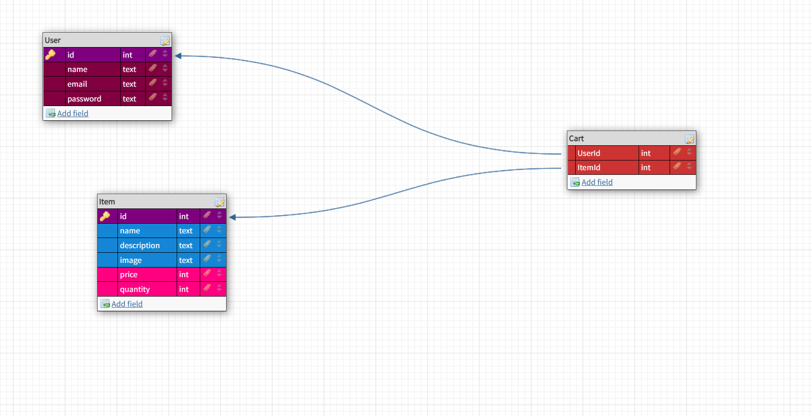
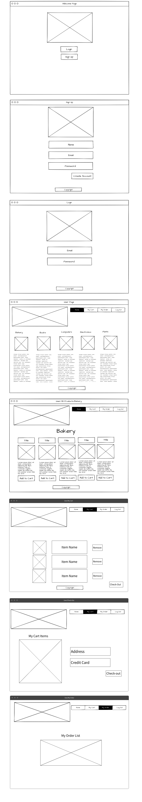

# Project-Three-Group

## Overview

This projects is about making an website that allows people to buy physical goods. The website would let the user register and login to their own account. Once login to their account, the user would be able to add and remove products from their cart. They are also able to see all of the products that is available to purchase. 

## Wireframe

## User Stories

:white_medium_small_square: User would create a account with the following name, email, and password.

:white_medium_small_square: User would login with their email and password. Then it would send to the user home page. 

:white_medium_small_square: User would be able to click on what category the user is interested in. 

:white_medium_small_square: Once the user find what they wanted. They are able to add the item to cart. 

:white_medium_small_square: Once done shopping, user is able to look into their cart. In there they could remove the item from the cart and then checkout. 

:white_medium_small_square: User is able to checkout their cart and there they would input their credit card and address. 

:white_medium_small_square: User is allow to check their recent orders.

## Routes 
| PATH | ROUTE | Description |
| --- | --- | --- |
| /user | POST | Signup/Create user |
| /user/login | POST | Login user |
| /user | GET | Verify user |
| /items | GET | All products |
| /items/:id | GET | product detail |
| /cart/:id | POST | Add to cart |
| /cart | GET | Show my cart |
| /cart | DELETE | Remove from cart |

## Core Goals 

:one:&nbsp; When I first visit the site, I'm on a home page that just has a simple welcome message.

:two:&nbsp; When not logged in, I see links to home, signup & login only. If I were to visit any of these routes manually while logged in, I would get redirected to the home page.

:three:&nbsp; I can create an account, log in, and log out.

:four:&nbsp; When logged in, I see links to home, logout, All Products, My Cart, and My Orders. If I were to visit any of these routes manually while logged out, I would get redirected to the home page.

:five:&nbsp; The All Products page lists the names of all available products. Clicking on any product name takes me to its details page, which include a name, description, image, and price.

:six:&nbsp; The products are pre-seeded in the db. You are welcome to use one of the provided "seeders" files, or you may create your own. Examine the seeder file to understand what model you'll need to create (i.e. "product") and what attributes it will need (i.e. name, image, description, price, etc.).

:seven:&nbsp; In the Product Details page is an Add To Cart button, which saves the product in my cart. If I want to buy more than 1 of a product in an order, I can add it to my cart multiple times, and each one is displayed as a distinct product. (There's no way to buy in bulk.)

:eight:&nbsp; The My Cart page lists products that I have put into my cart. Next to each product is a Remove From Cart button, which removes the item from my cart (the item should disappear from the page without requiring a page refresh). The total of my order is displayed on the page (we're ignoring tax and shipping). There is a Checkout button which creates an order containing all the items from my cart, then empties the cart. In order to checkout, the shopper must input an address and a credit card number. These values will get saved to the order, but we won't do anything with them in this project. After checking out, the user is redirected to the My Orders page.

:nine:&nbsp; The My Orders page displays a list of my completed orders, using the date of the order as a clickable link. When I click on a single order, I see the Single Order page, which shows its products (name and price), the total price of the order, and the credit card & address.

## Strech Goals

:one:&nbsp; Each Product has a quantity in the database. When a user buys a product, its quantity is reduced. Products with a quantity of 0 are not displayed in the All Products page. (A user can still only buy 1 of a product at a time.)

:two:&nbsp; The app has one (or more) designated admin users. When an admin user logs in, they do not see the All Products, My Cart, and My Orders links. Instead, they see Manage Products and Orders To Fill.

:three:&nbsp; Manage Products MVP: The admin user sees a list of all products, and next to each one is an input to adjust the quantity of that product.

:four:&nbsp; Orders To Fill MVP: The admin user sees a list of all orders (from all users), which initially are in a Pending state. For each order, the admin user can click a button to convert it from Pending to Shipped. Shipped orders don't have a button, just a text or icon indicator that they've been shipped.

:five:&nbsp; Manage Products stretch: The admin user can add new products, and edit or delete existing ones.

:six:&nbsp; Implement userId encryption and password hashing (stretch goals from https://git.generalassemb.ly/SEIR-1011/express-user-authentication).

:seven:&nbsp; Deploy your app to Heroku. You'll need to make two separate deployments (frontend and backend).

# Getting Started with Create React App

This project was bootstrapped with [Create React App](https://github.com/facebook/create-react-app).

## Available Scripts

In the project directory, you can run:

### `npm start`

Runs the app in the development mode.\
Open [http://localhost:3000](http://localhost:3000) to view it in the browser.

The page will reload if you make edits.\
You will also see any lint errors in the console.

### `npm test`

Launches the test runner in the interactive watch mode.\
See the section about [running tests](https://facebook.github.io/create-react-app/docs/running-tests) for more information.

### `npm run build`

Builds the app for production to the `build` folder.\
It correctly bundles React in production mode and optimizes the build for the best performance.

The build is minified and the filenames include the hashes.\
Your app is ready to be deployed!

See the section about [deployment](https://facebook.github.io/create-react-app/docs/deployment) for more information.

### `npm run eject`

**Note: this is a one-way operation. Once you `eject`, you can’t go back!**

If you aren’t satisfied with the build tool and configuration choices, you can `eject` at any time. This command will remove the single build dependency from your project.

Instead, it will copy all the configuration files and the transitive dependencies (webpack, Babel, ESLint, etc) right into your project so you have full control over them. All of the commands except `eject` will still work, but they will point to the copied scripts so you can tweak them. At this point you’re on your own.

You don’t have to ever use `eject`. The curated feature set is suitable for small and middle deployments, and you shouldn’t feel obligated to use this feature. However we understand that this tool wouldn’t be useful if you couldn’t customize it when you are ready for it.

## Learn More

You can learn more in the [Create React App documentation](https://facebook.github.io/create-react-app/docs/getting-started).

To learn React, check out the [React documentation](https://reactjs.org/).

### Code Splitting

This section has moved here: [https://facebook.github.io/create-react-app/docs/code-splitting](https://facebook.github.io/create-react-app/docs/code-splitting)

### Analyzing the Bundle Size

This section has moved here: [https://facebook.github.io/create-react-app/docs/analyzing-the-bundle-size](https://facebook.github.io/create-react-app/docs/analyzing-the-bundle-size)

### Making a Progressive Web App

This section has moved here: [https://facebook.github.io/create-react-app/docs/making-a-progressive-web-app](https://facebook.github.io/create-react-app/docs/making-a-progressive-web-app)

### Advanced Configuration

This section has moved here: [https://facebook.github.io/create-react-app/docs/advanced-configuration](https://facebook.github.io/create-react-app/docs/advanced-configuration)

### Deployment

This section has moved here: [https://facebook.github.io/create-react-app/docs/deployment](https://facebook.github.io/create-react-app/docs/deployment)

### `npm run build` fails to minify

This section has moved here: [https://facebook.github.io/create-react-app/docs/troubleshooting#npm-run-build-fails-to-minify](https://facebook.github.io/create-react-app/docs/troubleshooting#npm-run-build-fails-to-minify)
